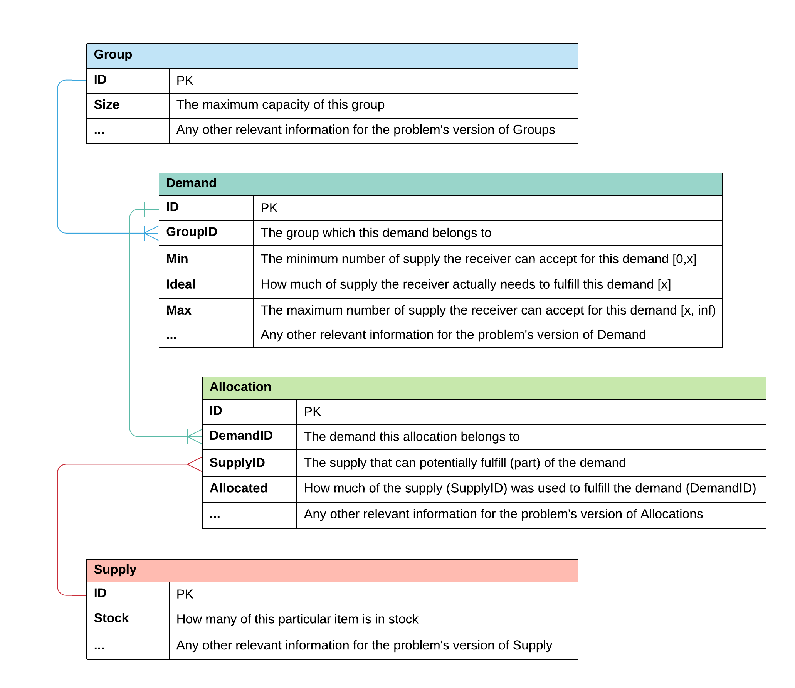

# SDP Data Set Generator

Application for generating SDP data sets - Part of Research Project - BScHons Computer Science

## Current State

Due to deadlines and accelerated development, unit tests are not up to date and running `ng test` will currently fail. There are still a couple of missing main features that will be implemented in the future. At this time, I am not accepting feature requests, and the software comes as is. It is currently required to run locally since it isn't hosted somewhere.

## Missing Features

- Choice and String do not work - have to implement input lists.
- Save and Load of templates are not implemented.
- [Bug] Column(y) can only reference a column(x)'s value when editing (y), not during creation of (y)
- [Bug] If column(y) and column(x) have the same type, setting (y)'s value to reference (x) doesn't work properly
- [Bug] If column(y) was referencing column(x) and the type of (y) is changed to the same type as (x), it breaks (x)

## Setup

### Dependencies

The project requires NodeJS, NPM and the Angular CLI to run. Installing NodeJS ([available here](https://nodejs.org/en/)) also installs NPM. You can then use `npm install -g @angular/cli` to get the Angular CLI. Run `npm install` to download all required node modules for the project.

### Run local server

Run `ng serve` and navigate to `http://localhost:4200/` or run `ng serve -o` to automatically open the browser tab. The app will automatically reload if you change any of the source files.

### Code scaffolding

Run `ng generate component component-name` to generate a new component. You can also use `ng generate directive|pipe|service|class|guard|interface|enum|module`.

### Build

Run `ng build` to build the project. The build artifacts will be stored in the `dist/` directory. Use the `--prod` flag for a production build.

### Running unit tests

Run `ng test` to execute the unit tests via [Karma](https://karma-runner.github.io).

### Running end-to-end tests

Run `ng e2e` to execute the end-to-end tests via [Protractor](http://www.protractortest.org/).

### Further help

To get more help on the Angular CLI use `ng help` or go check out the [Angular CLI README](https://github.com/angular/angular-cli/blob/master/README.md).

## Supply Demand Problem (SDP) Template

